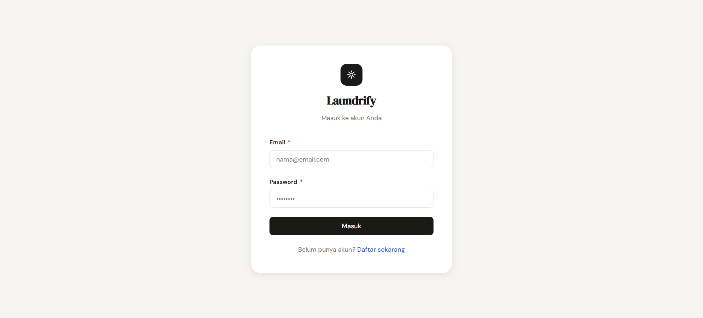
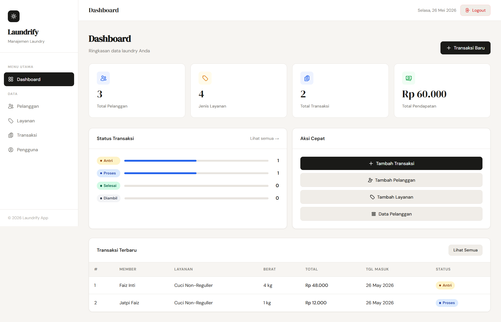
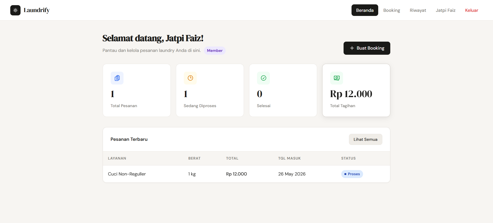
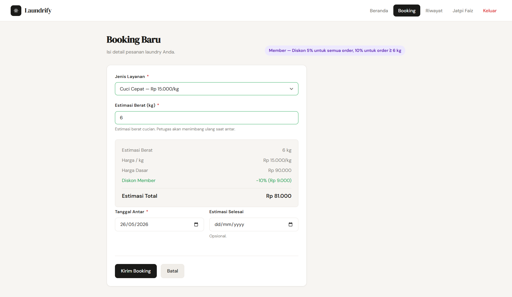
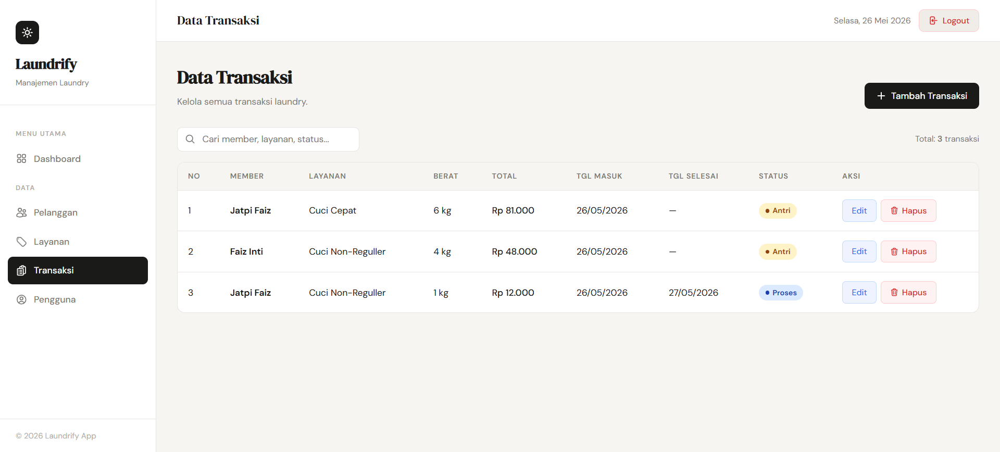
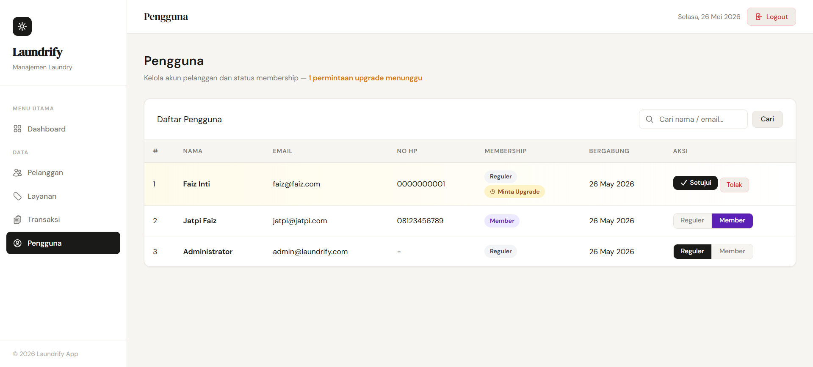

<div align="center">

# 🌀 Laundrify App

**Sistem Manajemen Laundry Berbasis Web**


> Aplikasi web manajemen laundry lengkap dengan dua panel:<br>
> **Admin** untuk pengelolaan bisnis dan **User** untuk pemesanan mandiri oleh pelanggan.

</div>

---

## 📸 Preview

<table>
  <tr>
    <td align="center"><b>Halaman Login</b></td>
    <td align="center"><b>Dashboard Admin</b></td>
  </tr>
  <tr>
    <td></td>
    <td></td>
  </tr>
  <tr>
    <td align="center"><b>Panel Pelanggan</b></td>
    <td align="center"><b>Halaman Booking</b></td>
  </tr>
  <tr>
    <td></td>
    <td></td>
  </tr>
  <tr>
    <td align="center"><b>Data Transaksi</b></td>
    <td align="center"><b>Manajemen Pengguna</b></td>
  </tr>
  <tr>
    <td></td>
    <td></td>
  </tr>
</table>

---

## ✨ Fitur Utama

### 👨‍💼 Panel Admin

| Fitur                     | Keterangan                                                               |
| ------------------------- | ------------------------------------------------------------------------ |
| 📊 **Dashboard**          | Statistik real-time: total pelanggan, layanan, transaksi, dan pendapatan |
| 👥 **Data Pelanggan**     | CRUD pelanggan dengan tanda bintang ★ untuk member premium               |
| 🏷️ **Data Layanan**       | Kelola jenis layanan dan harga per kg                                    |
| 🧾 **Data Transaksi**     | Kelola seluruh transaksi dengan pembaruan status                         |
| 👤 **Manajemen Pengguna** | Kelola akun pelanggan dan ubah tier membership                           |
| ✅ **Approve Membership** | Setujui atau tolak permintaan upgrade dari pelanggan                     |

### 📱 Panel Pelanggan (User)

| Fitur                    | Keterangan                                               |
| ------------------------ | -------------------------------------------------------- |
| 🏠 **Beranda**           | Ringkasan pesanan aktif, selesai, dan total tagihan      |
| 📅 **Booking Mandiri**   | Pesan laundry sendiri dengan kalkulasi harga otomatis    |
| 📋 **Riwayat Pesanan**   | Lihat semua pesanan dan batalkan yang masih antri        |
| 👤 **Profil & Password** | Ubah informasi akun dan ganti password                   |
| ⭐ **Sistem Membership** | Ajukan upgrade ke Member untuk mendapat diskon eksklusif |

### 🎖️ Sistem Membership

```
Reguler  →  Tidak ada diskon

Member   →  Diskon  5%  untuk semua order
         →  Diskon 10%  untuk order ≥ 6 kg
```

Pelanggan dapat mengajukan upgrade langsung dari halaman profil. Admin menyetujui atau menolak dari panel pengguna.

---

## 🗂️ Struktur Proyek

```
laundrify-app/
│
├── auth/                    # Autentikasi
│   ├── login.php
│   ├── register.php
│   └── logout.php
│
├── config/                  # Konfigurasi global
│   ├── db.php               # Koneksi database (MySQLi)
│   ├── session.php          # Manajemen sesi & role guard
│   ├── header.php           # Layout admin (sidebar + topbar)
│   ├── footer.php           # Penutup layout admin
│   └── membership.php       # Logika tier & kalkulasi diskon
│
├── pages/                   # Modul admin
│   ├── member/              # CRUD data pelanggan
│   ├── services/            # CRUD layanan laundry
│   ├── transaction/         # CRUD transaksi
│   └── users/               # Manajemen akun & membership
│
├── user/                    # Panel pelanggan
│   ├── index.php            # Beranda user
│   ├── booking.php          # Form booking + kalkulasi diskon
│   ├── riwayat.php          # Riwayat pesanan
│   ├── profile.php          # Profil & pengaturan akun
│   └── proccess_*.php       # Handler POST
│
├── assets/
│   ├── css/style.css        # Design system (CSS custom properties, responsive)
│   └── js/script.js         # Toast, sidebar, validasi form, kalkulasi otomatis
│
├── database/
│   ├── laundri_db.sql               # Schema + data awal
│   ├── migration_auth.sql           # Migrasi tabel users
│   └── migration_membership.sql     # Migrasi kolom membership
│
└── docs/                    # Screenshot untuk README
```

---

## 🗄️ Skema Database

```sql
┌─────────────────────────────────────────────┐
│  member                                     │
│  id · nama · no_hp · alamat · created_at    │
└────────────────────┬────────────────────────┘
                     │ id_member
┌────────────────────▼────────────────────────┐
│  users                                      │
│  id · nama · email · password · no_hp       │
│  alamat · id_member · role                  │
│  membership (reguler|member)                │
│  membership_request (none|pending)          │
└────────────────────┬────────────────────────┘
                     │ id_user, id_member
┌────────────────────▼────────────────────────┐
│  transaksi                                  │
│  id · id_user · id_member · id_layanan      │
│  berat_kg · harga_dasar · diskon_persen     │
│  total_harga · status · tgl_masuk           │
│  tgl_selesai                                │
└─────────────────────────────────────────────┘

┌─────────────────────────────────────────────┐
│  layanan                                    │
│  id · nama_layanan · harga_per_kg           │
└─────────────────────────────────────────────┘
```

---

## 🚀 Cara Menjalankan

### Prasyarat

- [XAMPP](https://www.apachefriends.org/) (PHP 8.x + MySQL 5.7+)
- Browser modern (Chrome / Firefox / Edge)

### Langkah Instalasi

**1. Letakkan folder project di dalam `htdocs`**

```
C:\xampp\htdocs\laundrify-app\
```

**2. Buat database dan import skema**

```bash
# Via MySQL CLI
mysql -u root -e "CREATE DATABASE laundri_db;"
mysql -u root laundri_db < database/laundri_db.sql
```

> Atau buka **phpMyAdmin** → buat database `laundri_db` → klik **Import** → pilih `database/laundri_db.sql`

**3. Jalankan Apache & MySQL**

Buka **XAMPP Control Panel** → klik **Start** pada Apache dan MySQL.

**4. Buka aplikasi di browser**

```
http://localhost/laundrify-app/
```

### Akun Default

| Role     | Email                           | Password   |
| -------- | ------------------------------- | ---------- |
| 🔑 Admin | `admin@laundrify.com`           | `admin123` |
| 👤 User  | Daftar melalui halaman Register | —          |

---

## 🛠️ Teknologi

| Teknologi        | Versi     | Kegunaan                                            |
| ---------------- | --------- | --------------------------------------------------- |
| **PHP**          | 8.x       | Backend, logika bisnis, autentikasi sesi            |
| **MySQL**        | 5.7+      | Penyimpanan dan relasi data                         |
| **Apache**       | via XAMPP | Web server lokal                                    |
| **HTML5**        | —         | Struktur halaman                                    |
| **CSS3**         | —         | Tampilan responsif dengan custom properties         |
| **JavaScript**   | Vanilla   | Kalkulasi otomatis, validasi form, notifikasi toast |
| **Google Fonts** | —         | DM Sans & DM Serif Display                          |

> **Tanpa framework** — murni PHP prosedural, CSS native, dan JavaScript vanilla.

---

## 📱 Responsive Design

Aplikasi dirancang responsif untuk semua ukuran layar:

- **Desktop** → Sidebar tetap, tabel penuh
- **Tablet** → Sidebar dapat disembunyikan dengan tombol hamburger
- **Mobile** → Tabel berubah menjadi tampilan kartu berlabel, navigasi dropdown

---

## 👨‍💻 Tentang Proyek

<div align="center">

Proyek ini dikembangkan sebagai **Tugas Akhir Mata Pelajaran Pilihan**

**Nama Siswa** &nbsp;·&nbsp; Kelas XI TKJ &nbsp;·&nbsp; SMK Negeri 4 Bandung

---

_Dibuat dengan penuh semangat pisan_

</div>
